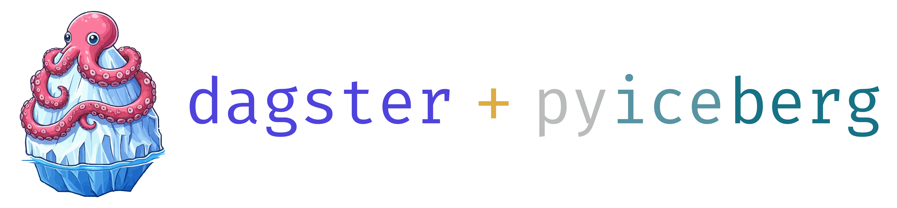

> ⚠️ Under construction

Dagster IO manager for managing [PyIceberg](https://github.com/apache/iceberg-python) tables.

This implementation is based on the [dagster-deltalake](https://github.com/dagster-io/dagster/tree/master/python_modules/libraries/dagster-deltalake) IO manager.

## Documentation

Documentation can be found [here](https://jasperhg90.github.io/dagster-pyiceberg/).

## To do

- Clean functions (underscores etc)
- Examples:
  + Use same examples as dagster-deltalake
  + Docstrings
- Polars + Duckdb packages
- Versioning (check other community packages)
- Templates for GH issues
- Update GHA pipeline
- Push to PyPi
- Testing:
  + Try load test with multiple materializations at the same time
- Add to community list of dagster
